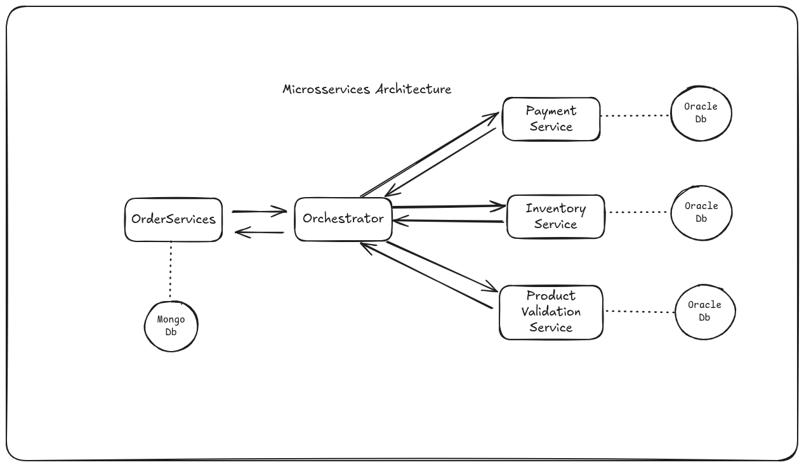

**Projeto de Microsserviços com Padrão SAGA Orquestrado - Spring Boot, Kafka, OracleDB, MongoDB, Docker, AWS e Kubernetes**

---

### 🌍 Visão Geral do Projeto

**Nome do Projeto**: OrderFlow - Sistema de pedidos distribuídos

**Objetivo**: Criar uma aplicação composta por microsserviços que simula um fluxo de pedido (Order Flow), com orquestração SAGA, utilizando o ecossistema Java/Spring Boot e tecnologias modernas de nuvem.

---

### 📊 Arquitetura Geral

**Serviços**:

- **Order Service**: Responsável por iniciar pedidos (usa MongoDB)
- **Payment Service**: Processa pagamentos (OracleDB)
- **Inventory Service**: Verifica e reserva estoque (OracleDB)
- **Orchestrator Service**: Controla o fluxo SAGA entre os serviços
- **Notification Service**: Envia confirmações (Kafka consumer)

**Bancos de Dados**:

- **MongoDB**: Order Service (estrutura de pedido aninhada e flexível)
- **OracleDB**: Payment e Inventory Services

**Outros Componentes**:

- **Kafka**: Barramento de eventos
- **Docker**: Containerização de serviços
- **Kubernetes (EKS)**: Orquestração de containers
- **Terraform**: Infraestrutura como código para AWS
- **JUnit + Mockito**: Testes

---

### 📅 Roadmap de Desenvolvimento

#### 1. Planejamento e Design

- Definir entidades e fluxos da aplicação
- Criar diagramas da arquitetura e do fluxo SAGA
- Selecionar tecnologias (Spring Boot, MongoDB, OracleDB, Kafka, etc.)

#### 2. Configuração do Ambiente

- Criar projeto base com Spring Initializr
- Configurar Docker para MongoDB, OracleDB e Kafka
- Subir stack local com Docker Compose

#### 3. Implementação dos Microsserviços

##### Order Service (MongoDB)

- CRUD de pedidos com Spring Data MongoDB
- Cada pedido é salvo como documento JSON
- Inicia a saga via chamada ao Orchestrator

##### Orchestrator Service

- Recebe eventos e coordena chamadas via REST/Kafka
- Mantém estado da transação (opcional: usar DynamoDB)

##### Payment Service (OracleDB)

- Confirma ou recusa pagamentos com Spring Data JPA
- Expõe endpoint consumido pelo Orchestrator

##### Inventory Service (OracleDB)

- Verifica e reserva produtos
- Usa transações locais e confirma via orquestração

##### Notification Service

- Kafka Consumer para eventos de sucesso ou falha
- Simula envio de email/SMS

#### 4. Testes

- Unitários com JUnit 5
- Mocks com Mockito
- Testes de integração entre serviços com TestContainers

#### 5. Infraestrutura AWS com Terraform

- Provisionar:

  - EKS (Kubernetes)
  - RDS (Oracle)
  - DocumentDB (MongoDB gerenciado)
  - MSK (Kafka gerenciado)

- Criar scripts `.tf` para todos os recursos

#### 6. CI/CD (GitHub Actions)

- Build, Test, Push Docker Image
- Deploy para EKS
- Uso de Helm charts para gestão dos deployments

---

### 🌐 Design Patterns Utilizados

- **SAGA Orquestrado**
- **DTO/Assembler** para troca de dados
- **Service Layer**
- **Factory** para instanciar eventos ou comandos
- **Retry com Circuit Breaker** usando Resilience4j

---

### 📊 Benefícios do Uso do MongoDB no Order Service

- Estrutura flexível de documentos para pedidos
- Sem necessidade de mapeamentos complexos
- Permite evoluir estrutura do pedido sem migrações

---

### 🌐 Diagrama da Arquitetura

  <h3>Microsservices Architecture</h3>
  

---
